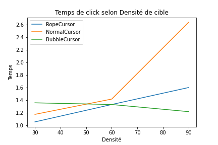
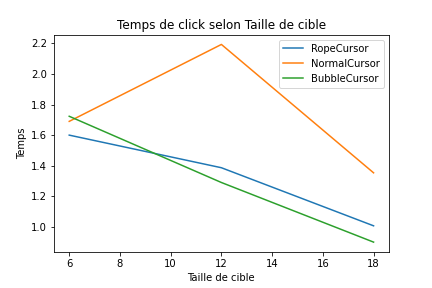
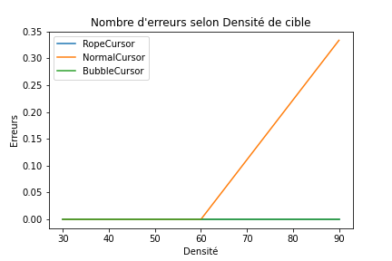
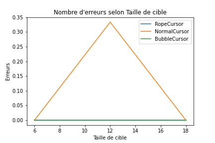

# **Compte-Rendu IIHM - Expérience Contrôlée**

<h2 id="init"> <strong>Sommaire</strong> </h2>

1. <a href="#contexte"><strong>Contexte</strong></a>
   1. <a href="#utile"><strong>Utilitaire</strong></a>
   2. <a href="#sujet"><strong>Sujet</strong></a>
   3. <a href="#choix"><strong>Choix</strong></a>
2. <a href="#expe"><strong>Expérience</strong></a>
   1. <a href="#variable"><strong>Variables</strong></a>
   2. <a href="#hypo"><strong>Hypothèses</strong></a>
   3. <a href="#setup"><strong>Mise en Place</strong></a>
   4. <a href="#deroulement"><strong>Déroulement</strong></a>
   5. <a href="#recup"><strong>Récupération des données</strong></a>
3. <a href="#inter"><strong>Interprétation</strong></a>
4. <a href="#conclu"><strong>Conclusion</strong></a>

<h2 id="contexte"> <strong>Contexte</strong> <a href="#init">🔼</a> </h2>

<h3 id="utile"> <strong>Utilitaire</strong> </h3>

Mail de l'étudiant : [antoine.nollet.etu@univ-lille.fr](mailto:antoine.nollet.etu@univ-lille.fr)

Lien du dépôt gitlab : [https://gitlab-etu.fil.univ-lille.fr/nollet/iihm](https://gitlab-etu.fil.univ-lille.fr/nollet/iihm)

<h3 id="sujet"> <strong>Sujet</strong> </h3>

Dans le cadre de l'Unité d'Enseignement (UE) de l'[Initiation à l'Intéraction Homme-Machine](https://www.fil.univ-lille1.fr/portail/index.php?dipl=MInfo&sem=RVA&ue=IIHM&label=Pr%C3%A9sentation) (IIHM) de la [1ere année du Master Informatique](https://www.fil.univ-lille1.fr/portail/index.php?dipl=MInfo&label=Pr%C3%A9sentation) mention [Réalité Virtuelle et Augmentée](https://www.fil.univ-lille1.fr/portail/index.php?dipl=MInfo&sem=RVA&ue=ACCUEIL&label=Pr%C3%A9sentation) (RVA), moi, [Antoine Nollet](mailto:antoine.nollet.etu@univ-lille.fr), ait eu l'occasion de mener une expérience contrôlée sur différentes méthodes de sélection de cibles circulaires par souris afin de déterminer les facteurs qui influencent le temps de réaction des utilisateurs.

La mise en place étant expliquée plus en détail dans la section ["Expérience"](#expe), l'expérience teste 3 méthodes de sélection :

* Bubble Cursor 

  

Un disque vert est tracé entre le curseur et la cible la plus proche, la cible la plus proche change donc de couleur pour indiquer que c'est celle-ci qui est sur le point d'être sélectionnée si l'utilisateur clique.

* Rope Cursor

  

Un trait noir est tracé entre le curseur et la cible la plus proche, la cible la plus proche change donc de couleur pour indiquer que c'est celle-ci qui est sur le point d'être sélectionnée si l'utilisateur clique.

* Normal Cursor

  

Il faut que le curseur soit directement posé sur la cible qu'on souhaite sélectionner.

Et ces méthodes sont testées dans différents contextes :

* Différents Utilisateurs (on lancera plusieurs fois l'expériences avec différentes personnes)
* Différentes Densités de Cibles (plus ou moins de cibles dans un espace limité)
* Différentes Tailles de Cibles (plus ou moins grosses)

<h3 id="choix"> <strong>Choix</strong> </h3>

Lors de la mise en place de l'expérience, il a fallut faire des choix.

**Faut il garder ou non les mêmes terrains pour tous les utilisateurs ?**

Si les terrains sont différents, on prend le risque que la disposition soit plus ou moins dure selon l'essaie et on ne sera donc pas équitable entre les utilisateurs. Les résultats seraient différés et non recevable pour établir un résultat représentatif qui ne dépende pas du profil des utilisateurs. On choisira donc de conserver les mêmes terrains pour tous les utilisateurs.

**Mais si nous utilisons les mêmes terrains, ne prenons nous pas le risque que l'utilisateur s'apparente avec le terrain et qu'il effectue donc l'expérience de plus en plus facilement indépendamment de la technique utilisée ?**

Bien que les terrains soient les mêmes pour une densité et un taille de cible donné, nous testons différentes densité et taille de cibles : nous faisons donc le choix de tester les dispositions technique/densité/taille mais dans un ordre aléatoire. Ainsi, chaque utilisateur effectue la même expérience, mais dans un ordre différent. On pourrait considérer le fait que si un utilisateur tombe sur le même terrain deux fois d'affilé mais avec des techniques différentes, il serait favorisé : mais on maintiendra notre choix pour la simple raison que cela est peu probable et que si nous considérons des terrains différents pour chaque combinaison technique/densité/taille, ils y auraient beaucoup trop de données à stocker.

**La succession des cibles sera la même pour tous les utilisateur ?**

Bien que les dispositions soient effectuées de manière aléatoire, pour une disposition taille/densité donnée, chaque utilisateur aura la même succession de cibles à sélectionner. Si cela n'était pas le cas, on prendrait le risque que la difficulté d'une succession qu'un utilisateur a eu le favorise ou le défavorise par rapport aux autres. On ne veut pas que les successions des cibles soient une variable indépendante qui influence l'expérience. 

On pourrait décider d'utiliser les mêmes séquences mais de les commencer à différents endroits (au début de la séquence, au milieu...) : cela permettrait de faire en sorte que les utilisateurs ne soient pas influencer par la suite des cibles (car ils feraient au final la même succession, même si elle n'est pas commencé au même endroit) et qu'ils ne soient pas non plus tentés de retenir de mémoire la succession pour la prochaine fois où ils feront le même terrain mais avec une technique différente. 

Cependant, s'il y a beaucoup de cibles, qu'on ne commence pas la séquence au même endroit et que le bloc (nombre de fois où on doit cliquer sur un terrain) est petit, on prend le risque qu'on essayait justement d'éviter en utilisant une même séquence pour un terrain donné. Deux utilisateurs faisant la même expérience sur le même terrain pourrait alors avoir deux successions de cible totalement différentes (alors que venant de la même séquence) et donc l'un pourrait être avantagé sur l'autre.

On fera donc le choix de pré-établir des séquences de cibles, et que chaque utilisateur commencera au même endroit.

**On pourrait commencer à des endroits différents d'une séquence si la méthode de curseur change ?**

En effet, cela éviterait qu'un utilisateur soit favorisé par la succession des dispositions qu'il teste : si il a deux fois de suite le même terrain, mais que seul la méthode de curseur change, l'utilisateur effectuera le teste d'une meilleure manière la seconde fois, indépendamment de lequel des curseurs est le plus performant.

Mais il s'agira d'accepter que potentiellement une méthode, pour un terrain donné, ait de manière fixe une succession plus facile que les autres méthodes.

On préférera ne pas rendre fixe le favoritisme à une méthode, car c'est le hasard qui fait qu'un utilisateur tombe deux fois de suite sur le même terrain. Toute les méthodes ont la même probabilité que l'utilisateur les croise sur le même terrain qu'il vienne de tester pour une autre méthode.

<h2 id="expe"> <strong>Expérience</strong> <a href="#init">🔼</a> </h2>

<h3 id="variable"> <strong> Variables </strong> </h3>

Lors de l'expérience, nous voulons observer comment ces différents facteurs, ces variables indépendantes, influent dans la sélection de cible par curseur :

* Méthode de curseur : Bubble Cursor, Rope Cursor, Normal Cursor
* Nombre de cibles : plus ou moins de cibles dans l'espace donné (1024x800 pixels)
* Taille des cibles : plus ou moins petites cibles

Il faut déterminer d'autres facteurs, des variables dépendantes, qui permettent d'avoir un référentiel sur lequel s'appuyer pour mesurer comment les variables indépendantes influent la sélection de cible par curseur. Les voici :

* Temps : combien de temps à sélectionner une cible
* Nombre d'erreurs : combien de fois l'utilisateur s'est trompé avant de cliquer sur la bonne cible, mesurant la précision

<h3 id="hypo"> <strong> Hypothèses </strong> </h3>

Nos hypothèses pour cette expérience contrôlée sont les suivantes :

* Plus une cible est grosse plus il est facile de la sélectionner (pas beaucoup de temps et pas beaucoup d'erreur)
* Plus il y a de cible, plus il est compliqué de retrouver celle que nous devons sélectionner (plus de temps et plus d'erreur)
* Le Bubble Cursor et le Rope Cursor seront des curseurs plus efficaces que le curseur normal.

<h3 id="setup"> <strong> Mise en place </strong> </h3>

Ainsi, nous mettons en place l'environnement de test dans lequel nous placerons nos utilisateurs.
Nous considérons que chacun a le même périphérique d'entrée qui permettra de déplacer le curseur : une souris. On considère également que les utilisateurs ont tous une même taille de fenêtre de 1024x800 pixels pour effectuer l'expérience. Chaque utilisateur va prendre environs 15 à 20 minutes pour effectuer le test durant lequel ils devront essayer de cliquer sur chaque cible rouge le plus vite possible et en faisant le moins d'erreur que possible.

Voici la fenêtre de dialogue de mise en place de l'expérience : 

  

On peut y rentrer les informations suivantes :

* **Numéro d'Utilisateur** : permettant d'identifier les futurs résultats
* **Technique utilisée** : choisir All si on veut toutes les tester, sinon on sélectionne celle qu'on veut tester
* **Nombre de densités** : nombre de densités différentes testées
* **Nombre de tailles de cibles** : nombre de tailles de cibles différentes testées
* **Nombre de répétitions** : taille des blocs de test, c'est à dire combien de fois nous allons devoir cliquer avec une technique, densité et taille de cible donnée

Ainsi, pour chaque expérience, l'utilisateur effectuera C clicks. C étant défini comme ceci :

C = Te x D x Ta x R + E

Où Te est le nombre de techniques testées, D est le nombre de densités testées, Ta est le nombre de tailles de cibles testées , R est le nombre de répétition (taille de bloc de test) et E est le nombre d'erreurs effectuées par l'utilisateur.

Il y a 3 techniques différentes, on peut tester 10 densités, tailles de cibles et répétitions. Ainsi, pour tester tout ce qui est possible de tester dans notre mise en place, l'utilisateur devra au minimum effectuer 3x10x10x10 soit 3000 clicks.

Après pratique, on se rend vite compte que tester autant de click est très long et fastidieux pour les utilisateurs... On se contentera donc de 3 densités différentes (30,60 et 90) et de 3 tailles différentes (6, 12 et 18). Ainsi, nous aurons certe moins de données (3x3x3x10 = 270), mais cela restera néanmoins significatif.

<h3 id="deroulement"> <strong> Déroulement</strong> </h3>

Une fois le paramétrage de l'expérience terminé, l'utilisateur peut commencer l'expérience.

  

Il sera affiché en titre de fenêtre combien de clicks correct l'utilisateur a effectué sur le nombre total de click à effectuer. Les cibles sont bleues à l'état de base, elles sont rouges lorsqu'il faut les sélectionner, elles sont vertes lorsqu'on a notre curseur sur elles et elles sont magenta lorsqu'on a le curseur dessus et qu'il faut la sélectionner.

L'utilisateur testera donc différentes dispositions techniques/densité/tailles de cibles dans un ordre quelconque mais avec des terrains et séquences pré-définis.

L'expérience, pour "punir" l'erreur, affichera la pop up suivante lorsque l'utilisateur effectuera un mauvais click :

  

Nous considérons qu'à tout moment, l'utilisateur qui effectue l'expérience est en droit de s'arrêter quand bon lui semble.

  

Dans cette optique, à chaque click de l'utilisateur, les données d'expériences seront actualisées dans un fichier CSV(simple ajout de données).

<h3 id="recup"> <strong> Récupération des données</strong> </h3>

Une fois les expériences terminées et que nous n'actualisons plus le fichier de résultats, nous allons pouvoir récupérer les données afin de les interpréter. Les données sont donc de la forme suivante :

* 1ere colonne : numéro d'utilisateur
* 2eme colonne : id de la cible dans sa séquence
* 3eme colonne : temps mis pour cliquer sur la cible
* 4eme colonne : nombre d'erreurs effectuées avant de cliquer sur la cible
* 5eme colonne : la technique utilisée
* 6eme colonne : la densité utilisée
* 7eme colonne : la taille de cible utilisée

<h2 id="inter"> <strong>Interprétation</strong> <a href="#init">🔼</a> </h2>

À partir des variables dépendantes et indépendantes, nous pouvons déterminer à l'avance quels graphiques nous voudrons obtenir à la fin de notre expérience.

Il y a deux variables dépendantes : le temps et les erreurs. Il y a trois variables indépendantes : la technique, la densité et la taille.

Ainsi, nous aurons des graphiques représentant :

* Le temps selon la densité

  

* Le temps selon la taille

  

* Les erreurs selon la densité

  

* Les erreurs selon la taille

  

Sur chacun de ces graphiques, il y a 3 courbes : une pour chacune des techniques.

Nous pouvons donc faire les observations suivantes de ces graphes :

* Plus la taille de cible est importante, plus est facile de la sélectionner
* Plus il y a de cibles dans l'espace donné, moins il sera facile de les sélectionner
* Les méthodes de curseur Bubble et Rope sont plus efficaces que le curseur normal

<h2 id="conclu"> <strong>Conclusion</strong> <a href="#init">🔼</a> </h2>

Nous pouvons donc conclure que nous avons prouvé expérimentalement nos hypothèses.

Cependant nous pouvons faire diverses critiques :

* Le panel de public de cette expérience n'était pas assez développé, ce qui peut biaiser les résultats
* Les méthodes commencent au même endroit selon les terrains, il n'y a pas eu beaucoup de test, alors il se peut qu'une méthode ait été favorisé au dépend des autres

Nous pouvons également ouvrir sur d'autres perspectives de test sur la sélection de cible par curseur :

* l'influence des couleurs des cibles
* l'influence du PPI de la souris (la vitesse de la souris)
* l'influence du périphérique utilisé (souris, pavé tactile, geste..)

Mais pour conclure ce travail d'expérience contrôlé, j'appuierai le fait que ce fût enrichissant, d'un point de vue théorique et d'un point de vue pratique, de mettre au point un tel protocol expérimental.